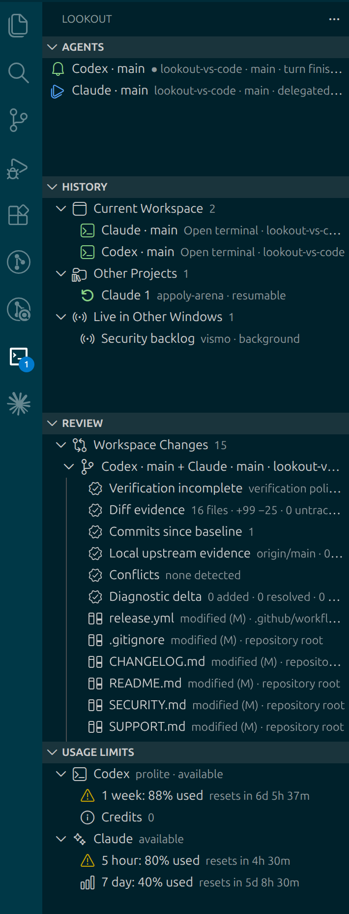
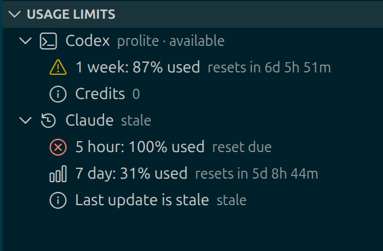
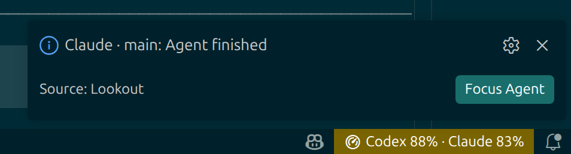

# Lookout for VS Code

Run, monitor, and review several terminal coding agents while VS Code remains
your editor, diff viewer, task runner, and source-control client.

> **Preview:** Lookout 0.1 is an early public release. The core workflow is
> tested, but provider CLI integrations and remote-platform behavior can change
> as Codex, Claude Code, and VS Code evolve.

> **Use at your own risk:** Lookout launches third-party coding agents and other
> commands you select. Those tools can read, change, or delete files and can run
> further commands with your user account's permissions. Review commands,
> provider permissions, and agent-produced changes; use source control and keep
> appropriate backups. Lookout is provided **as is**, without warranties or a
> guarantee that it will prevent data loss, security incidents, incorrect code,
> or other damage. To the fullest extent permitted by law, Appoly and Lookout's
> contributors are not liable for losses or claims arising from its use. The
> [MIT License](LICENSE) contains the governing warranty and liability terms.

Lookout is built around one loop:

```text
launch agents → keep coding → see who needs attention → jump there → review the work
```

Parallel agents only pay off when you can stop watching them. Lookout routes
your attention — permission checks, questions, finished turns — so you keep
working until an agent actually needs you.

It uses native VS Code terminals and review surfaces instead of putting another
terminal emulator or code viewer inside a webview.

## Lookout at a glance

The Lookout sidebar keeps active agents, cross-project history, live sessions
from other windows, review evidence, and plans in one place.

<p align="center">
  
</p>

## What Lookout adds

- **Agents** — launch Codex, Claude Code, or a custom command in a named native
  terminal. Focus, split, rename, restart, adopt, and safely remove sessions from
  one tree.
- **Attention routing** — explicit provider lifecycle hooks distinguish working,
  delegated-agent activity, authorization checks, finished turns, and genuine
  waits for input. Unread badges, status-bar state, notifications, and an optional
  bell make background work visible.
- **Continuity** — move through unread agent events, browse closed history
  backed by a bounded, metadata-only event ledger, and explicitly resume or
  fork supported provider-owned sessions without reading their transcripts.
- **Cross-project history** — reopen a previous project and hand a confirmed
  provider resume or fork to its Lookout window. Historical rows never claim
  that an old terminal is still live.
- **Live coordination (experimental)** — optionally see metadata-only agent
  state from other VS Code windows on the same profile and execution host,
  route attention to the owning window, and refuse duplicate provider resumes.
- **Profiles and templates** — detect direct provider CLIs, explain degraded
  wrapper capabilities, and save reusable launch recipes without persisting raw
  commands, arguments, environment variables, prompts, or credentials.
- **Review** — open each session's Git changes as native diffs against its
  launch commit, grouped by worktree with branch-switch warnings and separately
  classified plans and docs. Diagnostics, Tasks, Test Explorer, debugging,
  Source Control, recent images, and a local browser stay VS Code-owned
  surfaces, one step away. Bounded Git/diagnostic evidence and an explicit
  native Task-backed verification run make ready/failed/stale claims visible
  without parsing terminal output.
- **Usage Limits** — show authoritative Codex and Claude account windows and
  reset times. Unknown, stale, unsupported, and signed-out states stay distinct
  from zero usage.
- **Isolated worktrees** — optionally create and launch an agent in a sibling Git
  worktree when parallel tasks should not share a working tree.

## Requirements

- VS Code Desktop 1.96.0 or newer. Lookout is not a browser/web extension.
- At least one terminal agent command: `codex`, `claude`, or a custom command.
- Git for change baselines, worktree creation, and the Review view.
- Node.js on the agent terminal's `PATH` for Codex/Claude lifecycle hooks and the
  Claude usage bridge. Core terminal launching still works when those integrations
  are disabled.
- A trusted workspace for anything that launches commands. Review and usage
  remain available in Restricted Mode.

Lookout does not install or authenticate agent CLIs for you. Sign in through each
provider's own CLI before relying on lifecycle or usage information.

## Quick start

1. Install Lookout from the VS Code Marketplace, or install a release VSIX with
   **Extensions: Install from VSIX…**.
2. Open a trusted Git workspace and select the **Lookout** icon in the Activity
   Bar.
3. In **Agents**, select `+`, choose Codex, Claude Code, or Custom, then choose a
   working folder. New terminals open in the native terminal panel by default;
   change `lookout.terminals.location` to `editor` if editor-area terminals fit
   your layout better.
4. Give each session a useful label, then let agents work in parallel. Select a
   row or use **Lookout: Focus Next Agent Needing Attention** to jump directly to
   the terminal that needs you. Drag Current Workspace rows to keep agents in
   your preferred order; Lookout remembers that order for the workspace.
5. Use **Review** to inspect native diffs and plans, run tasks or tests, open
   Source Control, and return to the agent with feedback.

On the first Codex launch, Lookout explains the one-time `/hooks` review needed
for full lifecycle detail. The turn-complete fallback works before those hooks
are trusted. Claude hooks are session-local, passed through a generated
`--settings` file kept in Lookout's own extension storage; Lookout never
modifies your user or repository Claude settings.

## Useful commands

| Command | Purpose |
| --- | --- |
| `Lookout: New Agent…` | Choose a provider and working folder. |
| `Lookout: New Agent in Isolated Worktree…` | Create a sibling worktree, then launch there. |
| `Lookout: Adopt Existing Terminal as Agent…` | Add an existing native terminal to the Agents view. |
| `Lookout: Focus Agent…` | Jump to any named agent. |
| `Lookout: Focus Next Agent Needing Attention` | Triage the next unread session. |
| `Lookout: Configure Cross-Window Coordination` | Enable or inspect the experimental same-host live coordinator. |
| `Lookout: Launch Agent from Template…` | Recreate a saved profile/folder/worktree/review recipe. |
| `Lookout: Open Review Layout` | Restore a two-column agent/review layout. |
| `Lookout: Run Verification Task…` | Run a native Test task and bind its observed exit to current review evidence. |
| `Lookout: Run Doctor` | Inspect trust, provider, lifecycle, usage, remote-host, and Git health. |
| `Lookout: Export Sanitized Support Bundle…` | Explicitly save a redacted, identifier-free diagnostic bundle. |
| `Lookout: Configure Attention Sound` | Open the bell enablement and volume settings. |
| `Lookout: Open Browser` | Open a local URL in VS Code's browser when available. |

The default shortcuts are `Ctrl+Alt+C` / `Cmd+Alt+C` for Codex,
`Ctrl+Alt+A` / `Cmd+Alt+A` for Claude Code, `Ctrl+Alt+N` / `Cmd+Alt+N` for the
next agent needing attention, and `Ctrl+Alt+B` / `Cmd+Alt+B` for the browser.
All shortcuts can be changed in Keyboard Shortcuts.

## Provider and usage settings

The most common settings are:

- `lookout.codex.command` and `lookout.claude.command` — provider launch commands;
- `lookout.codex.enabled` and `lookout.claude.enabled` — entries shown in the
  new-agent picker;
- `lookout.codex.lifecycleIntegration` and
  `lookout.claude.lifecycleIntegration` — session-local lifecycle hooks;
- `lookout.usage.codex.enabled` and `lookout.usage.claude.enabled` — usage
  providers and UI;
- `lookout.usage.codex.tokenBudget` — apply Codex's provider-managed rollout
  token budget to newly launched direct Codex sessions (`0` disables it);
- `lookout.usage.claude.contextWarningTokens` — highlight a Claude session
  when its live context reaches the configured size (`0` disables it);
- `lookout.terminals.location` — `panel` (default) or `editor`;
- `lookout.notifyOnAttention`, `lookout.notifyOnTurnComplete`, and
  `lookout.notifyOnAgentExit` — notification behavior;
- `lookout.attentionSound.enabled` and `lookout.attentionSound.volume` — the
  synthesized local bell;
- `lookout.review.showRecentImages` — opt in to recent-image scanning.
- `lookout.review.captureCommandOutput` — globally opt in to transient,
  bounded Codex/Claude command results for newly launched sessions.
- `lookout.history.globalEnabled` — retain bounded host-local session metadata
  for continuation and collision safety; enabled by default and never registered
  for Settings Sync.
- `lookout.experimental.crossWindowCoordination` — share live metadata between
  Lookout windows on the same execution host; disabled by default.

Codex account usage comes from the CLI's app-server JSON-RPC rate-limit method.
Claude account usage comes from its documented custom status-line JSON after the
first response in a Lookout-launched session. Those provider windows are
account-wide. The same Claude bridge also reports per-session live context,
estimated cost when available, and delegated-agent token counts; current-context
tokens are not cumulative spend. Codex can additionally receive a native rollout
token budget at launch. Claude's interactive CLI exposes no equivalent hard
token cap, so its configurable per-session threshold is warning-only.

The Usage Limits view distinguishes available, stale, exhausted, and reset-due
provider windows and lists tracked per-agent token data and budgets:



The same limits can remain visible as a compact status-bar summary while a
Lookout notification routes you back to an agent that has finished:



## Privacy and security

Lookout contains no telemetry or analytics and sends nothing to a Lookout-owned
server. It does not read authentication files or scrape terminal output. When
you explicitly enable command-result capture, it retains up to 8 KiB from the
provider's completed shell-tool result in memory only; it is never persisted.
Lifecycle events use a random bearer token over a size-limited HTTP server bound
only to `127.0.0.1`; custom agent commands are not persisted. Workspace-provided
command settings are restricted in untrusted workspaces, and execution commands
are disabled until the workspace is trusted.

Lookout persists opaque provider session IDs only when documented lifecycle
hooks report them. Its bounded event ledger stores fixed operational event kinds
and read state, never hook messages, prompts, command text, tool output, or
transcript paths. Numeric Claude context, cost, and budget metadata can be
stored with a session; delegated-agent identities and labels remain live-only
and are stripped at persistence boundaries. Support export is an explicit command and passes through an
allow-list plus defensive path, token, URL, and identifier redaction.
Unexpected internal failures are written to a local Lookout output channel as
fixed operation scopes and error types/codes only; free-form error messages are
not logged or included in support exports.

Cross-project history additionally stores the workspace/folder URI, working
directory, user-visible label, coarse host kind, provider identity, fixed
counters, and timestamps in Lookout's extension-global storage on that host.
It is not Settings Sync data. Experimental live coordination keeps window and
session summaries in memory behind an authenticated loopback protocol; its
shared secret is stored through VS Code SecretStorage. It does not persist live
snapshots or send them between local, WSL, SSH, and container hosts.

The agent CLIs you launch remain separate software with their own network and
data-handling behavior. See [PRIVACY.md](PRIVACY.md) for exactly what Lookout
stores and [SECURITY.md](SECURITY.md) for private vulnerability reporting.

## Known limitations

- Lookout never infers attention from terminal output. Custom agents must invoke
  the copied attention-hook command when they need to signal Lookout.
- In-place restart requires VS Code shell-execution tracking and a confirmed
  command end. After an untracked launch or extension-host reload, close the
  terminal and launch a new agent instead of restarting into uncertain input.
- Lifecycle hooks are quoted for the default terminal shell (PowerShell 5 and 7,
  cmd, and POSIX shells such as bash, zsh, and fish). With an unrecognized
  default shell, agents launch plainly and the session reports that hooks are
  unavailable.
- Shared-worktree changes are attributed to the worktree and its attached agents,
  never claimed as the work of one specific agent. Use isolated worktrees when
  per-agent attribution matters.
- Provider-owned delegated agents are represented as lifecycle state, not as
  separate terminal panes.
- Virtual workspaces such as `vscode.dev` are unsupported because Lookout needs
  native terminals, filesystem paths, and Git processes.
- Live coordination is one-profile, one-execution-host only. It can coordinate
  local windows with local windows, or windows on the same WSL/SSH/container
  host, but it does not federate those environments. Revealing a terminal in
  another window is a routed request; OS focus-stealing policies may still
  require selecting that window.
- Arbitrary tmux-style spatial layouts, terminal transcript storage, and browser
  automation are deliberately out of scope.

## Optional Compound Engineering compatibility

Lookout recognizes common plan, research, solution, todo, and changelog paths.
For a fuller artifact convention, it is compatible with The Workshop, a
separately released skill pack. Lookout does not bundle, install, or update it.

## Development

```bash
npm ci
npm run check
npm run test:integration
npm run compat:providers
npm run vsix
npm run verify:vsix
```

The extension-host suite exercises activation, terminal launch and splitting,
authenticated attention routing, Git review baselines, host-local history
projection, and terminal closure. Domain tests additionally exercise concurrent
history writers and real authenticated loopback coordinator clients.
CI runs Stable on Linux, Windows, and macOS, plus VS Code 1.96.0 on Linux. The
VSIX check also inspects an allow-listed package, installs it into an isolated
profile, activates the installed extension, and runs Doctor. See
[docs/TESTING.md](docs/TESTING.md) for test details and
[docs/RELEASE.md](docs/RELEASE.md) for the release checklist.

To work interactively, open this repository in VS Code, select **Run Lookout**
in Run and Debug, and press `F5`.

## Project records

- [Product and architecture decisions](docs/DECISIONS.md)
- [Pre-release product program](docs/plans/pre-release-program.md)
- [Implementation roadmap](docs/ROADMAP.md)
- [Interactive release test plan](docs/TESTPLAN.txt)
- [Product and technical research](docs/RESEARCH.md)

Lookout is an Appoly open-source project available under the
[MIT License](LICENSE). Support requests belong in the
[issue tracker](https://github.com/appoly/lookout-vs-code/issues); please
read [SUPPORT.md](SUPPORT.md) before filing one.

Lookout is an independent open-source project and is not affiliated with OpenAI
or Anthropic. Codex, Claude, and Claude Code are trademarks of their respective
owners.
